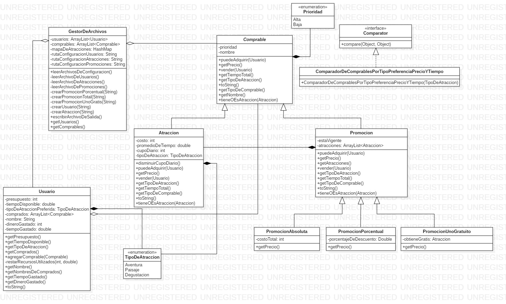

# Algoritmos y Programación II : TP 1

Integrantes: 
- Di Dio Gonzalo
- Lottero Bruno
- Lovera Alexander
- Posta Daniel

## Decisiones de diseño

- Se decidió utilizar polimorfismo para poder representar Atracciones y Promociones bajo una misma clase Comprable.
- El método que debe utilizarse para vender un Comprable es Comprable.vender(Usuario). 
Dicho método se encarga de reducir el cupo diario del Comprable y a su vez de agregar el Comprable en Usuario. 
Si Comprable no tiene cupo disponible o Usuario no tiene tiempo o saldo suficiente, lanza una excepción. El programador es responsable de llamar antes de vender(Usuario) al método puedeAdquirir(Usuario)
- Para el formato de los archivos de configuración se decidió utilizar:
	- usuarios:
		- Nombre,Presupuesto,TiempoDisponible
	- atracciones:
		- Nombre,Precio,Tiempo,Cupo,TipoDeAtraccion
	- promociones:
		-PromociÛn porcentual
			- Porcentual:estaVigente,Nombre,PorcentajeDeDescuento,Atraccion,Atraccion
		-PromociÛn total
			- Total:estaVigente,Nombre,Precio,Atraccion,Atraccion
		-PromociÛn uno gratis
			- UnoGratis:estaVigente,Nombre,AtraccionGratis,Atraccion,Atraccion
		- En todos los casos, se pueden especificar n atracciones para cada paquete.
- Se decidió utilizar un Comparator que se construye con la preferencia del Usuario para poder ordenar la lista de Comprables y luego generar las sugerencias.
- Se decidió que la vigencia de un paquete se configure desde el archivo de configuración.
- Para que Promocion tenga mas prioridad al ordenar los Comprables, se asigna enum Prioridad en el constructor de cada Comprable (en Promocion prioridad es Alta).
- Las promociones solo pueden contener atracciones de un solo tipo.
- La promoción porcentual redondea el precio para que sea entero.

## Diagrama UML

[Link a la im·gen](TP1_ver4.jpg)

## Descripción de cada archivo fuente

##### Atraccion.java

Constructor: `Atraccion(String nombre, int costo, double tiempo, int cupo, TipoDeAtraccion tipo)`

Representa a una atracción con su costo, tiempo, cupo y tipo.
Es responsable de decidir si se le puede vender al Usuario y de venderse al Usuario.

##### Promocion.java

Constructor: `Promocion(String nombre, boolean estaVigente, Atraccion[] atracciones)`

Promocion tiene un array de Atracciones y una vigencia.
Es responsable de decidir si se le puede vender al Usuario y de venderse al Usuario.

##### ComparadorDeComprablesPorTipoPreferenciaPrecioYTiempo.java

Constructor: `ComparadorDeComprablesPorTipoPreferenciaPrecioYTiempo(TipoDeAtraccion tipoDeAtraccion)`

Implementa la interfaz Comparator para Comprable y se construye con la preferencia de Usuario para ordenar la lista de Comprable.
Primero compara por tipo de atracción, luego compara por Prioridad, luego por precio y finalmente por tiempo.

##### Comprable.java

Constructor: `Comprable(String nombre, Prioridad prioridad)`

Es la clase que utilizamos para utilizar polimorfismo con Atraccion y Promocion.

##### GestorDeArchivos.java

Es una clase que contiene métodos estáticos encargados de leer y grabar archivos. Estos métodos son utilizados en main

##### Prioridad.java

Es un enumerador para establecer una prioridad a la hora de comparar dos objetos de tipo Comprable

##### PromocionAbsoluta.java

Constructor: `PromocionAbsoluta(String nombre, boolean estaVigente, Atraccion[] atracciones, int costoTotal)`

Extiende la clase Promocion, sobreescribe el método getPrecio() de Promocion para especificar un precio costoTotal por el paquete.

##### PromocionPorcentual.java

Constructor: `PromocionPorcentual(String nombre, boolean estaVigente, Atraccion[] atracciones, double porcentajeDeDescuento)`

Extiende la clase Promocion, sobreescribe el método getPrecio() de Promocion para descontar porcentajeDeDescuento del precio total del paquete.

##### PromocionUnoGratuito.java

Constructor: `PromocionUnoGratuito(String nombre, boolean estaVigente, Atraccion[] atracciones, Atraccion obtieneGratis)`

Extiende la clase Promocion, guarda en un atributo la referencia al objeto de tipo Atraccion que se obtiene gratis al comprar el paquete.
Sobreescribe el método getPrecio() para descontar del precio total el precio de la atraccion que se obtiene gratis.

##### Sistema.java

Es la clase que contiene el punto de entrada (main). De aquí se obtiene el ejecutable de la aplicación.

##### TipoDeAtraccion.java

Enumera todos los tipos de Atraccion del sistema (Aventura, Paisaje, Degustacion)

##### Usuario.java

Constructor: `Usuario(String nombre, int presupuesto, double tiempoDisponible, TipoDeAtraccion tipoDeAtraccionPreferida)`

Representa a un usuario del sistema, con su nombre, tipo de atracción preferida, presupuesto y tiempo para gastar.

## Conclusiones

- A la hora de recuperar instancias de un objeto de tipo Atraccion para construir las promociones, en lugar de hacer alg˙n tipo de b˙squeda en la lista de atracciones, se decidiÛ tener un diccionario de atracciones cuya clave es el nombre de la atracciÛn. De esta forma se recupera una atracciÛn con complejidad O(1) aunque con un uso algo m·s elevado de memoria.
- Para las listas se decidiÛ utilizar ArrayList en lugar de LinkedList ya que siempre insertamos elementos al final de las listas y tampoco necesitamos borrar elementos de posiciones intermedias.

